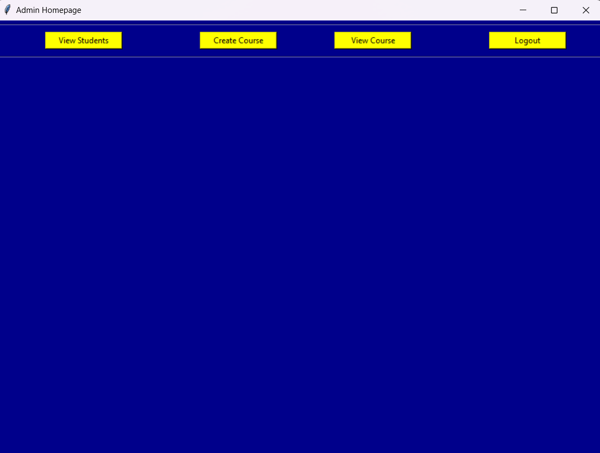
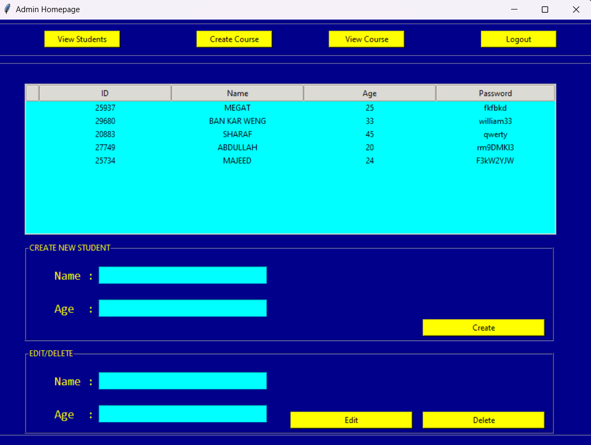
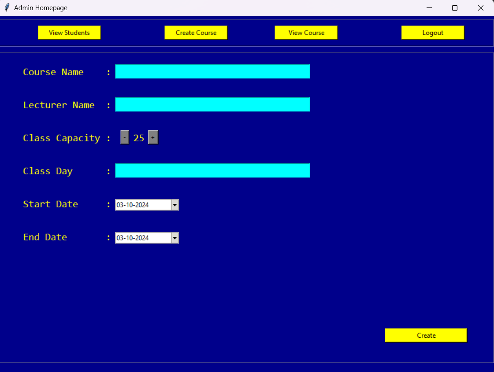
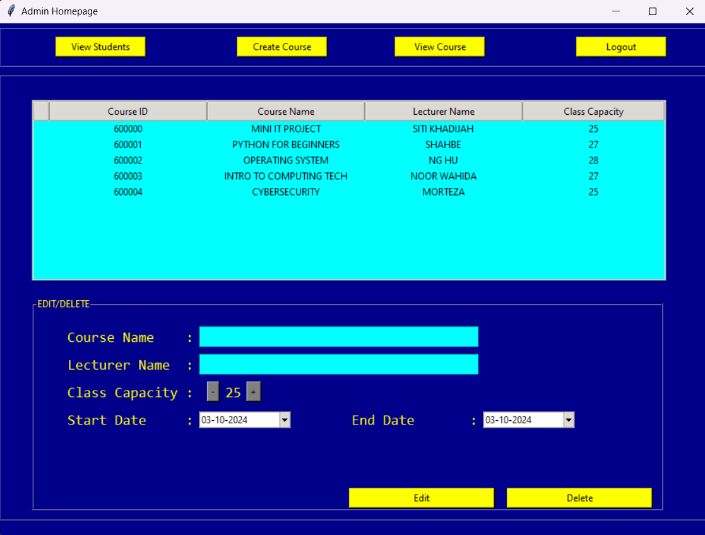
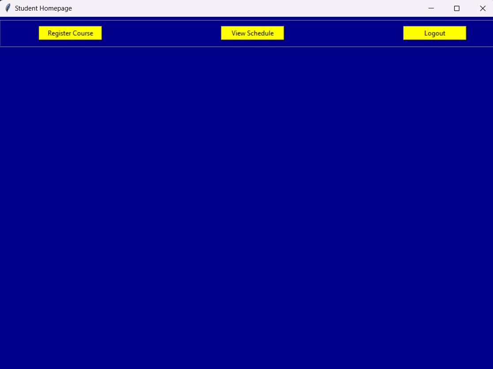
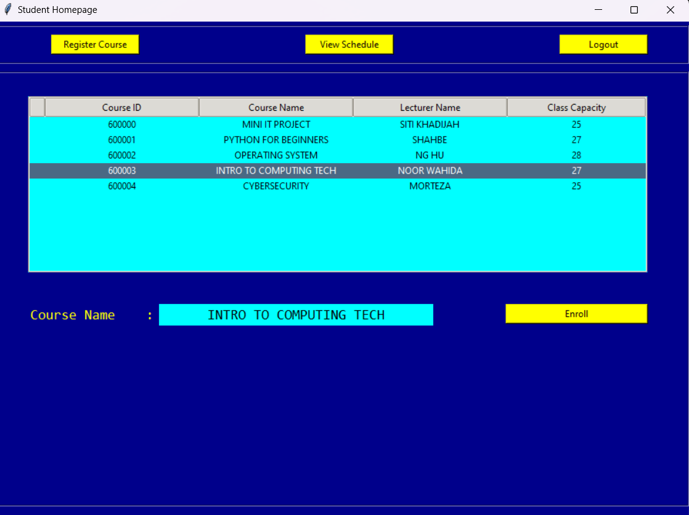
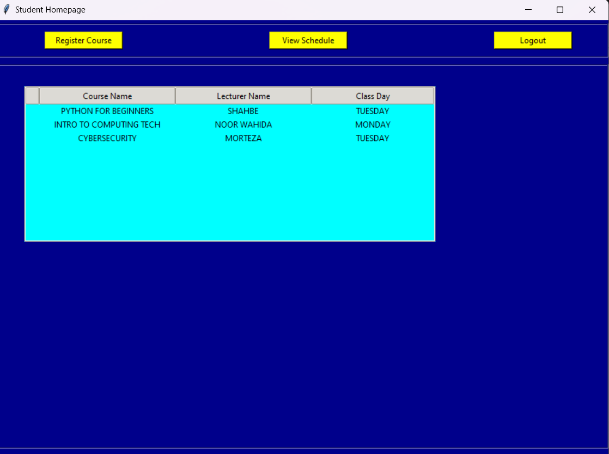

# Course Management System

## Introduction
The Course Management System is designed to facilitate the enrollment and management of courses for students and administrators. Students can easily enroll in courses, view available offerings, and access their timetables. Administrators have the ability to create and manage courses, add or remove students, and ensure the smooth operation of the course offerings.

## Platform
- **Language**: Python
- **Framework**: Tkinter

## Functional Requirements

| User      | Functional Requirement                                   |
|-----------|---------------------------------------------------------|
| Admin     | Login and Logout                                        |
|           | Create, Remove, and Update Students                     |
|           | Create, Remove, and Update Courses                      |
|           | Logout                                                  |
| Student   | Login and Logout                                        |
|           | Browse Courses Offered                                   |
|           | Register for Courses                                    |
|           | View Timetable                                          |

## Login Page

## Admin Page

### Admin Homepage

### View Students

### Create Course

### View Course

## Student Page

### Student Homepage

### Register Course

### View Schedule

